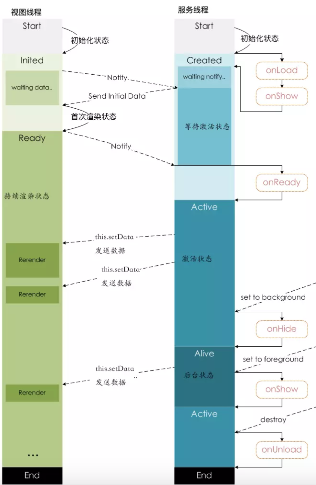

## 通信原理

小程序逻辑层和渲染层的通信由Native（微信客户端）做中转，逻辑层发送网络请求也由Native转发。

**视图层组件**：

内置组件中有部分组件是利用到客户端原生提供的能力，既然需要客户端原生提供的能力，那就会涉及到视图与客户端的交互通信。这层通信机制在ios和安卓系统的实现方式并不一样，ios是利用了WKWebView的提供messageHandlers特性，而在安卓则往WebView的window对象注入一个原生方法，最终会封装成WeiXinJSBridge这样一个兼容层，主要提供了调用(invoke)和监听(on)这两种方法。

微信小程序逻辑层没有浏览器的DOM/BOM，视图层的更新借助于Virtual DOM。用JS对象模拟DOM树 -> 比较两棵虚拟DOM树的差异 -> 把差异应用到真正的DOM树，状态更新的时候，通过对比前后JS对象变化，进而改变视图层的Dom树。实际上，在视图层与客户端的交互通信中，开发者只是间接调用，真正调用是在组件内部实现中。开发者插入一个原生组件，一般而言，组件运行的时候被插入到DOM树中，会调用客户端接口，通知客户端在哪个位置渲染一块原生界面。在后续开发者更新组件属性时，同样地，也会调用客户端提供的更新接口来更新原生界面的某些部分。

**逻辑层接口**：

逻辑层与客户端原生通信机制与渲染层类似，不同在于，ios平台可以往JavaScriptCore框架注入一个全局的原生方法，而安卓方面则是跟渲染层一致的。

同样地，开发者也是间接调用到与客户端原生通信的底层接口。一般我们会对逻辑层接口做层封装后才暴露给开发者，封装的细节可能是统一入参、做些参数校验、兼容各平台或版本问题等等。

